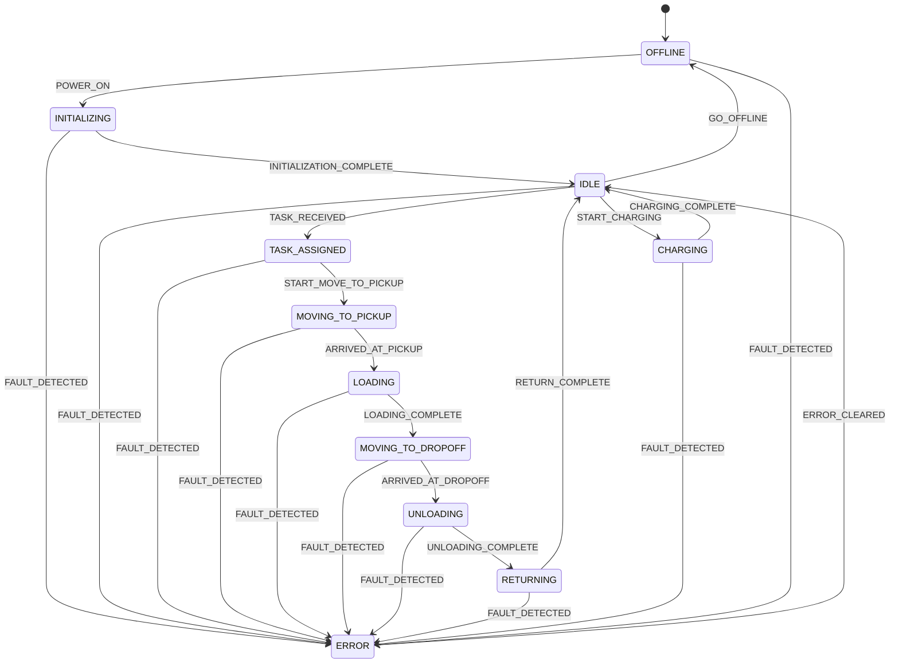

# Sprint 01.5 — Implementation Report
## Robot State Machine

Version: 1.0  
Status: Complete  
Date: 2026-07-22

---

# Summary

Sprint 01.5 introduces a dedicated **Robot State Machine** as the only component allowed to change `RobotStatus`. `RobotEngine` now requests transitions via events; it no longer calls status mutators directly.

Architecture layers (HAL, engine coordination, simulation) were left unchanged. This sprint builds on the Sprint 01 foundation.

---

# Transition Diagram

Supported happy-path chain:

`OFFLINE → INITIALIZING → IDLE → TASK_ASSIGNED → MOVING_TO_PICKUP → LOADING → MOVING_TO_DROPOFF → UNLOADING → RETURNING → IDLE`

Recovery / power:

- `ANY (except ERROR) → ERROR` via `FAULT_DETECTED`
- `ERROR → IDLE` via `ERROR_CLEARED`
- `IDLE → OFFLINE` via `GO_OFFLINE`
- `OFFLINE → INITIALIZING` via `POWER_ON`

---

# Design Decisions

## 1. Event-driven transitions

`RobotStateEvent` triggers transitions. The machine resolves `(currentStatus, event) → nextStatus` from a declarative table. New states/events can be added by extending the table without rewriting callers.

## 2. Single writer for status

`RobotState.updateStatus` was replaced with `applyStatus`, documented for exclusive use by `RobotStateMachine`. `RobotEngine` only calls `stateMachine.transition(...)` / helpers.

## 3. Invalid transitions fail loudly

`InvalidRobotStateTransitionException` is thrown with from-status, event, and (when known) attempted target. Status is left unchanged on failure.

## 4. Transition logging

Each successful transition is logged via `java.util.logging.Logger` at INFO:

`Robot '<id>' status transition: FROM -[EVENT]-> TO`

## 5. Engine mapping without warehouse movement

Sprint 01.5 does not implement pickup/dropoff behaviour. The engine uses:

| Engine action | State machine usage |
|---------------|---------------------|
| `start()` | `POWER_ON` then `INITIALIZATION_COMPLETE` (from `OFFLINE`) |
| `assignTask()` | `TASK_RECEIVED` |
| first `tick()` with task | `START_MOVE_TO_PICKUP` |
| task arrived | `advanceMissionToIdle()` (status-only walk to `IDLE`) |
| empty battery on mission | `FAULT_DETECTED` |
| `shutdown()` | `transitionToOffline()` (legal path only) |

`advanceMissionToIdle()` is an interim helper until Sprint 06 task execution drives each step explicitly.

## 6. Architecture untouched

No changes to HAL boundaries, MQTT policy, or layered runtime architecture documents.

---

# Assumptions

1. Fleet MQTT status vocabulary will map later from this richer enum; Sprint 01’s `WORKING` is replaced by mission substates.  
2. Graceful shutdown from mid-mission aborts via `FAULT_DETECTED → ERROR_CLEARED → GO_OFFLINE` (only legal path to `OFFLINE` from non-idle).  
3. `FAULT_DETECTED` while already in `ERROR` is invalid (no self-loop).  
4. Navigate-to-target completion still uses physical arrival from Sprint 01; post-arrival mission statuses are advanced without extra motion.

---

# Test Results

Command: `mvn test`  
Result: **BUILD SUCCESS** — **77 tests**, 0 failures, 0 errors.

| Suite | Focus |
|-------|--------|
| `RobotStateMachineTest` (45) | Valid / invalid / error / offline / recovery / edge cases |
| `RobotEngineTest` (10) | Engine uses state machine; lifecycle + fault |
| Existing Sprint 01 suites | Still green after status enum expansion |

---

# Files Created

## State machine

- `src/main/java/com/vectoros/robot/runtime/state/RobotStateMachine.java`
- `src/main/java/com/vectoros/robot/runtime/state/RobotStateTransition.java`
- `src/main/java/com/vectoros/robot/runtime/state/RobotStateEvent.java`
- `src/main/java/com/vectoros/robot/runtime/state/InvalidRobotStateTransitionException.java`

## Tests / docs

- `src/test/java/com/vectoros/robot/runtime/state/RobotStateMachineTest.java`
- `docs/sprints/SPRINT_01_5_ROBOT_STATE_MACHINE.md`
- `docs/reviews/SPRINT_01_5_IMPLEMENTATION_REPORT.md` (this file)

## Modified

- `src/main/java/com/vectoros/robot/runtime/model/RobotStatus.java` — expanded statuses
- `src/main/java/com/vectoros/robot/runtime/model/RobotState.java` — `applyStatus` replaces `updateStatus`
- `src/main/java/com/vectoros/robot/runtime/engine/RobotEngine.java` — status via state machine only
- `src/test/java/com/vectoros/robot/runtime/engine/RobotEngineTest.java`
- `src/test/java/com/vectoros/robot/runtime/model/RobotStateTest.java`

---

# Future Improvements

1. **Compile-time exclusivity** — Java module `exports` / package-private `applyStatus` once the module layout is introduced.  
2. **Listener hooks** — emit `RobotStatusChangedEvent` on the internal event bus for telemetry (Sprint 05).  
3. **Remove `advanceMissionToIdle()`** — replace with explicit per-step events from Task Execution (Sprint 06).  
4. **Shutdown policy** — add an explicit `ABORT_TO_IDLE` transition if fault-based shutdown is too harsh.  
5. **Fleet mapping layer** — map detailed statuses to coarser Fleet MQTT enums without leaking transport into the machine.

---

# Explicitly Out of Scope

- MQTT / REST / Database  
- Scheduling / Telemetry  
- Warehouse movement / path planning  
- Battery simulation  
- Movement Engine (Sprint 02)

Sprint 02 was not started.
